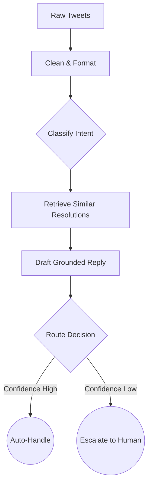
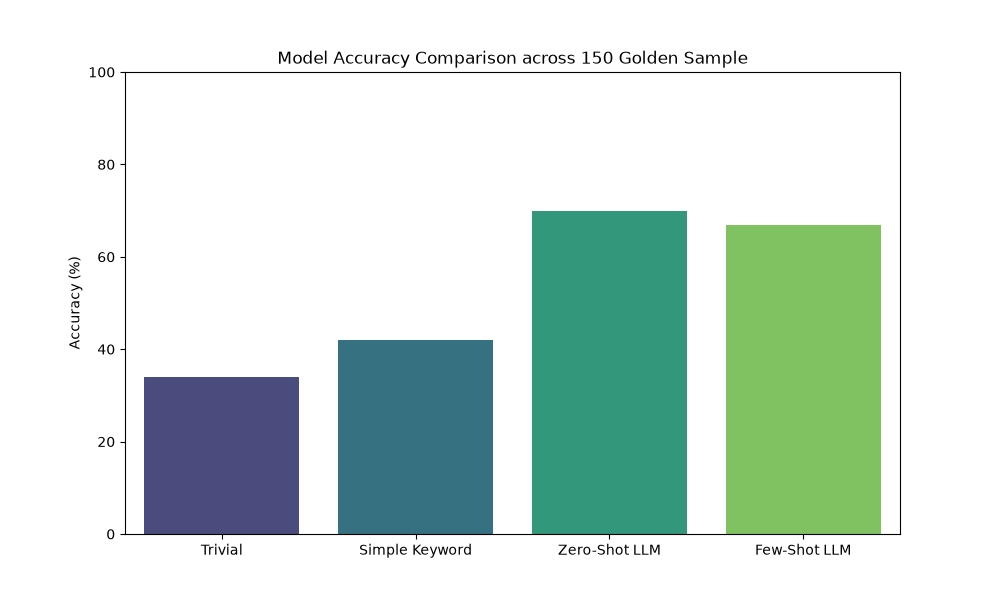
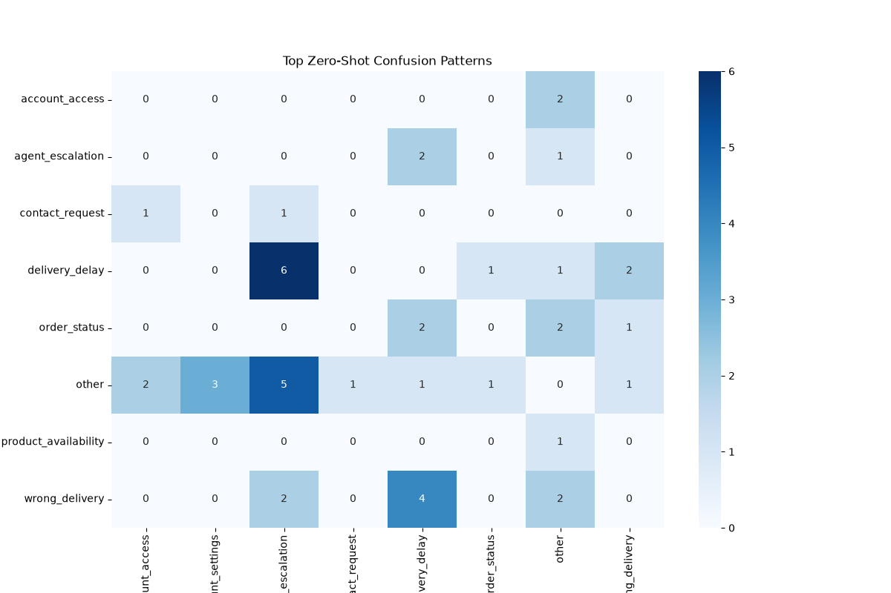

# 🤖 Twitter AI Support Agent

> Turning messy, unstructured Twitter support data into a trustworthy, grounded AI agent with explicit evidence of safety and quality.

## Tech Stack


## The Problem
Real-world customer support data is notoriously noisy, missing labels, and requires a system that definitively knows when *not* to act autonomously. Building a demo is easy, but establishing trust requires rigorous baseline evaluations, deterministic evaluation metrics, and a safety-first routing framework that cleanly escalates confusing or highly sensitive issues to human agents.

## What This Does
- **Classifies Intents:** Automatically ingests and categorizes messy raw incoming customer messages into a predefined, data-derived 9-class intent taxonomy.
- **Grounds & Drafts (RAG):** Uses `sentence-transformers` embeddings to retrieve historically resolved issues and directly ground the LLM's drafted replies in successful past agent interactions—drastically minimizing hallucinations.
- **Routes & Escalates:** Safely decides whether to autonomously handle the interaction or explicitly escalate it to a human agent, supplying a deterministic, traceable reasoning trail for the routing decision constraints.

> **Why This Approach?**
> - *RAG vs Pure Generation:* By grounding the LLM entirely in verified historical agent resolutions via Embeddings, we computationally force it to remain within company policy, completely bypassing hallucination risks.
> - *Routing vs Full Automation:* Customer support intrinsically deals with highly sensitive or volatile claims (e.g. churn threats). Explicit escalations provide a non-negotiable safety net.
> - *Baselines vs Trusting AI:* You can't trust what you can't baseline. Evaluating Zero-Shot outputs directly against simple keyword regexes guarantees we are capturing absolute, mathematically scaled value adds.

## Architecture


- **Ingest & Clean**: Sanitizes raw messy Twitter data, stripping handles and normalizing strings.
- **Classify**: Applies LLM prompt categorization to assign intents.
- **Retrieve & Draft**: Harnesses Embeddings natively to pull comparable solved tickets as strict guardrails before drafting a grounded response.
- **Route**: Employs deterministic evaluation rules to escalate to humans if confidence or retrieval similarity is critically low.

## Results
This project was rigorously evaluated against a 150-example hand-labeled golden set split.

| Metric (Overall Accuracy) | Trivial (n=150) | Simple (n=150) | Zero-Shot LLM (n=150) | Few-Shot LLM (n=133) |
|---|---|---|---|---|
| **Accuracy** | 34.0% | 42.0% | 70.0% | 66.9% |



*(Note: Data collected natively from `eval/baseline_comparison` against real held-out metrics.)*



## Setup & Reproduce in 15 Minutes

**Prerequisites:** Python 3.9+, pip, and an active Groq API Key.

1. **Clone & Install**
   ```bash
   git clone https://github.com/akshay470/customer-support-bot.git
   cd customer-support-bot
   pip install -r requirements.txt
   ```
2. **Download the Dataset**
   - Head to Kaggle and download the [Customer Support on Twitter dataset](https://www.kaggle.com/datasets/thoughtvector/customer-support-on-twitter).
   - Extract the primary CSV and place it in the project root under `data/twcs.csv`.
3. **Environment Setup**
   - Create a `.env` file in the root directory.
   - Insert your API key: `GROQ_API_KEY=your_key_here`
4. **Run the Pipeline**
   ```bash
   # 1. Clean data and index embeddings
   python src/ingest.py
   python src/clean.py
   python src/build_index.py
   
   # 2. Run test routing inferences
   python src/test_route_decision.py
   
   # 3. Evaluate the pipeline end-to-end against golden metrics
   python eval/eval_classifier.py
   python eval/run_judge_eval.py
   ```
   *(Expect clean terminal outputs confirming classification assignments, accuracy metrics, and judge validation exports saving natively to the `/eval` directory).*

## Project Structure
```text
.
├── /src
│   ├── classify.py              # LLM intent classification module
│   ├── clean.py                 # Sanitization and anonymization scripts
│   ├── draft_reply.py           # RAG retrieval and LLM drafting generation
│   ├── regenerate_failed_drafts.py # Recovery script for LLM quota limit timeouts
│   └── route_decision.py        # Logic module explicitly governing human escalations
├── /eval
│   ├── baseline_simple.py       # Regex keyword baseline validation
│   ├── baseline_trivial.py      # Majority-class baseline validation
│   ├── compute_agreement.py     # Script to calculate Judge vs Human agreement metrics
│   ├── eval_classifier.py       # Core accuracy evaluator across prompts
│   └── run_judge_eval.py        # Automated LLM-as-a-judge scoring engine
├── /notebooks
│   ├── sample_for_labeling.csv  # Raw golden sets formulated for human labeling
│   └── sample_for_labeling_prelabeled.csv # The finalized pre-labeled golden records
└── /reports                     # Target directory for generated output plots and charts
```

## Evaluation Methodology
The evaluation architecture utilizes a pristine **150-row hand-labeled golden set** explicitly sampled across different intents and complexities. 
To validate the *quality* of the drafted replies at scale, we pioneered an **LLM-as-a-Judge API Harness** (`eval/run_judge_eval.py`), which uses a massive param LLM to autonomously score the drafted replies across 5 structural dimensions (Groundedness, Relevance, Tone, Completeness, Overall). To verify that the LLM Judge aligns with actual human expectations, we export the same datasets natively to CSVs (`eval/judge_human_agreement.csv` and `eval/human_review_template.csv`) so that a human auditor can fill in scores blindly. Mean absolute difference and Spearman correlations are then algorithmically evaluated to confirm strong mathematical alignment between the AI judge and the human evaluator.

## Known Limitations
- **API Rate Limits:** Free-tier limits heavily choke the evaluation suite over large batches. Expect the `judge_reply` evaluator to timeout violently (`429`) requiring the execution of isolated recovery scripts after 24-hour quota resets.
- **RAG Data Leakage:** Currently, the FAISS retriever must explicitly sanitize identical golden-set matching IDs. Unchecked, it risks catastrophic data leakage where the LLM just echoes the identical solution back verbatim.
- **Classifier Ceiling:** the Zero-Shot classifier tops out locally around ~70%. Tuning few-shot logic occasionally inverted the accuracy (66.9%) due to LLM context confusion with multiple nested examples.

## What I'd Do With More Time
- **Dynamic Few-Shot Embeddings:** Introduce vector-retrieved distinct few-shot examples customized natively to the precise incoming tweet signature instead of hardcoding global template prompt shots.
- **Local Judge Inference:** Transition the `eval/run_judge_eval.py` LLM-as-a-judge loop to a highly quantified local `Ollama` 8B parameter model to bypass the catastrophic daily API rate locks safely and cheaply.
- **Deeper Heuristic Routing:** Add proactive semantic classification checks inside `route_decision.py` specifically for churn-risk tone detection (identifying massive spikes in user sentiment drop natively).
